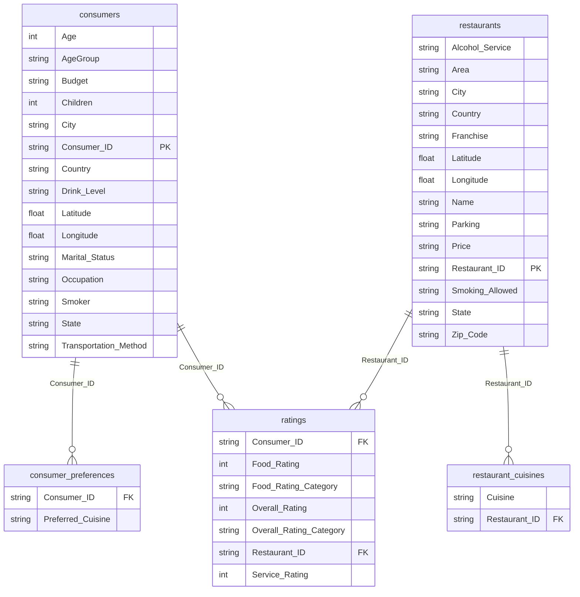

# 🍔 Restaurant Analysis


Welcome to the **Restaurant Analysis** project! This repository contains a comprehensive data analysis pipeline focused on understanding restaurant operations, customer behavior, and financial metrics.

## 📊 Overview

This project analyzes key metrics across a restaurant platform, providing actionable insights into:
- **Revenue & Orders**: Tracking total revenue, total orders, and average order value (AOV).
- **Customer Segmentation**: Comparing premium vs. regular customers and analyzing performance across different city tiers.
- **Operational Efficiency**: Monitoring service times, delay rates, and the impact of traffic and distance.
- **Customer Satisfaction**: Analyzing customer ratings, staff ratings, and cancellation rates.


## 🗄️ Database Entity-Relationship Diagram



## 📁 Repository Contents

- `restaurant_analysis_cleaned.csv`: The cleaned dataset used for the analysis, containing detailed customer, order, and service metrics.
- `Restaurant_Analysis.pbix`: The interactive **Power BI** dashboard file containing data visualizations, KPIs, and visual analytics.
- `Restaurant_Analysis.py`: A **Python** script (originally a Jupyter Notebook) that uses `pandas` and `matplotlib` to clean, transform, and visualize the data. It calculates correlations, trends, and summary statistics.
- `Restaurant_Analysis.sql`: **SQL** scripts used to query and aggregate metrics from the database (e.g., revenue by city tier, monthly trends, delay impacts on ratings).

## 🚀 Key Insights Explored

1. **Revenue Trends**: Monthly revenue analysis to identify peak ordering periods.
2. **Premium vs. Regular Customers**: Assessing the revenue contribution and cancellation rates of premium subscribers compared to regular users.
3. **Logistics & Delays**: Understanding how travel distance, weather severity, and traffic level scores impact average service times and delay probabilities.
4. **Cancellations**: Investigating cancellation rates across different city tiers and customer types.

## 🛠️ Technology Stack

- **Data Visualization**: Power BI
- **Data Manipulation & Analysis**: Python (Pandas, Matplotlib)
- **Database Querying**: SQL (MySQL/PostgreSQL syntax)

## 💻 Getting Started

### Power BI Dashboard
1. Ensure you have [Power BI Desktop](https://powerbi.microsoft.com/desktop/) installed.
2. Open `Restaurant_Analysis.pbix` to interact with the visualizations.

### Python Analysis
1. Install the required Python libraries:
   ```bash
   pip install pandas matplotlib
   ```
2. Place the `restaurant_analysis_cleaned.csv` dataset in the root directory.
3. Run the Python script:
   ```bash
   python Restaurant_Analysis.py
   ```

### SQL Queries
1. Import your dataset into your preferred SQL database.
2. Execute the queries in `Restaurant_Analysis.sql` to generate summary tables and aggregated views.

## 📄 License
This project is for analytical and educational purposes.
